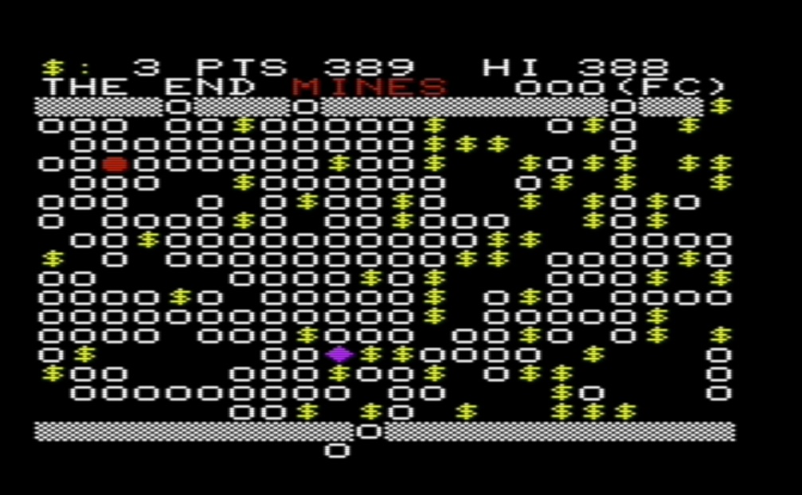
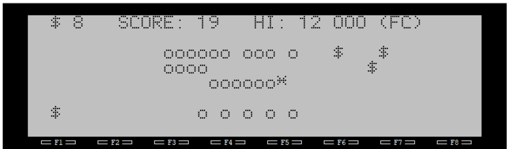
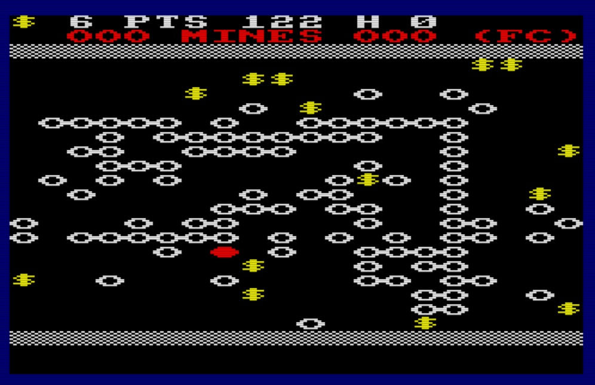
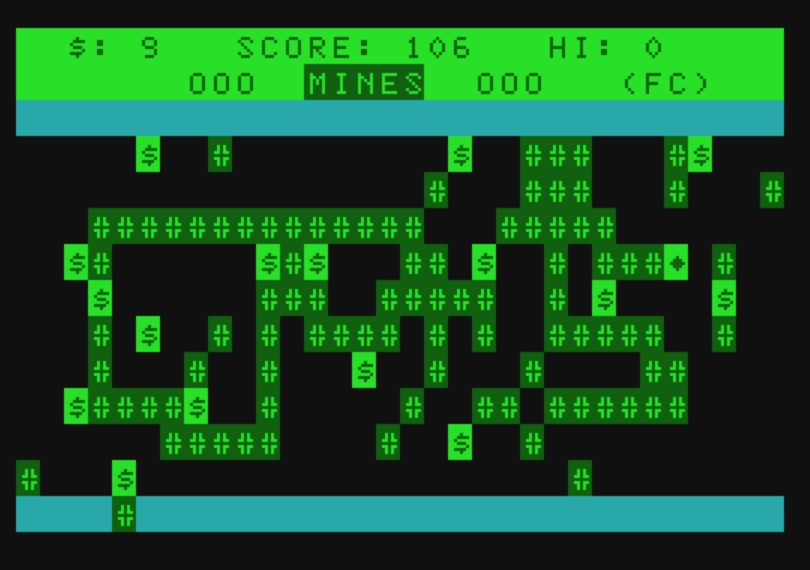
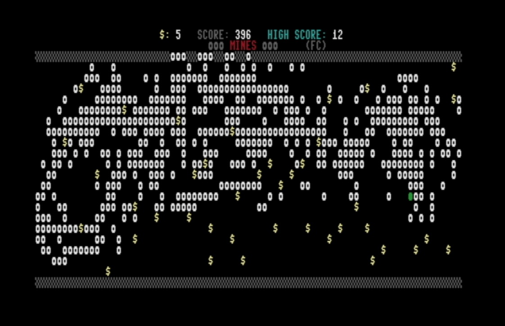
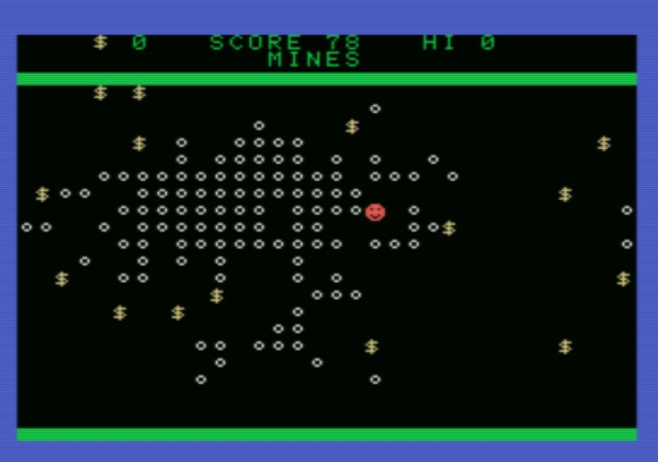

# Mines
MINES is a BASIC 10-liner in several different BASIC dialects

The below repositories contain the basic Mines game and in some case extended version of Mines:
- [10-liner] Mines (for all listed BASIC dialects): simplest version of the game
- [10-liner] Mines+ (MSX BASIC 1.0, CBM BASIC 3.5, Atari BASIC, Locomotive BASIC 1.0): it adds multiple lives, initial mines, frills
- [20-liner] Super Mines (Vic-20 only): turn-based version which also adds items
- [no limit] Hyper Mines (Vic-20 only): it adds more items and graphics

Currently supported BASIC Families:

- CBM BASIC: C64, Vic20, C128 (40 and 80 col), C16/116/+4, Pet, CBM-II, P500

https://github.com/Fabrizio-Caruso/CBM-BASIC-10-liners

- TRS-80 BASIC: Color Computer/Dragon, MC-10, Olivetti M10, VZ200

https://github.com/Fabrizio-Caruso/TRS-80-BASIC-10-liners

- ATARI BASIC

https://github.com/Fabrizio-Caruso/Atari-BASIC-10-liners

- LOCOMOTIVE BASIC

https://github.com/Fabrizio-Caruso/Locomotive-BASIC-10-liners

- SINCLAIR BASIC

https://github.com/Fabrizio-Caruso/Sinclair-BASIC-10-liners

- AQUARIUS BASIC

https://github.com/Fabrizio-Caruso/Aquarius-BASIC-10-liners

- MSX BASIC

https://github.com/Fabrizio-Caruso/MSX-BASIC-10-liners

